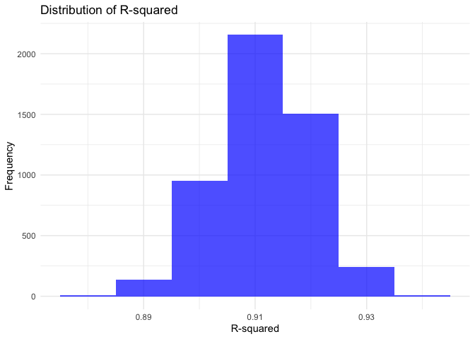
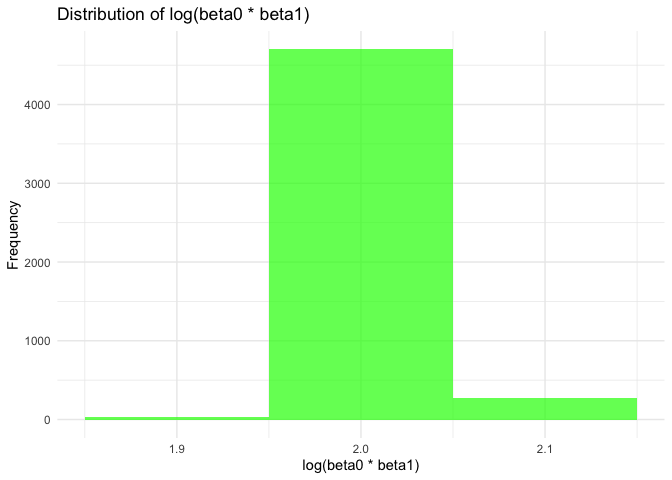
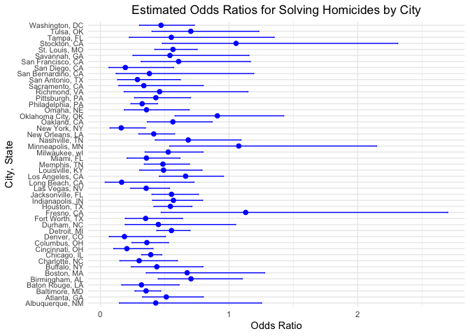
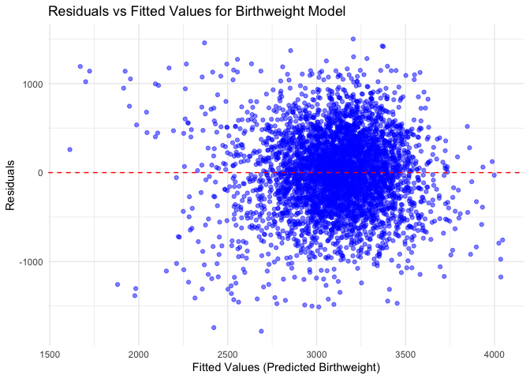

p8105_hw6_zl3543
================

### Problem 1

``` r
weather_df = 
  rnoaa::meteo_pull_monitors(
    c("USW00094728"),
    var = c("PRCP", "TMIN", "TMAX"), 
    date_min = "2017-01-01",
    date_max = "2017-12-31") %>%
  mutate(
    name = recode(id, USW00094728 = "CentralPark_NY"),
    tmin = tmin / 10,
    tmax = tmax / 10) %>%
  select(name, id, everything())
```

    ## using cached file: /Users/suwa/Library/Caches/org.R-project.R/R/rnoaa/noaa_ghcnd/USW00094728.dly

    ## date created (size, mb): 2024-11-29 18:53:21.859976 (8.667)

    ## file min/max dates: 1869-01-01 / 2024-11-30

The dataset contains daily weather measurements for Central Park, NYC,
in 2017, including precipitation (PRCP), minimum temperature (TMIN), and
maximum temperature (TMAX). Temperatures are converted from tenths of a
degree Celsius to Celsius for better interpretability.

``` r
set.seed(123)  # Set seed for reproducibility

# Perform bootstrap sampling
bootstrap_results <- 
  replicate(
    5000, 
    {
      # Sample with replacement
      sample_data <- weather_df %>% sample_frac(replace = TRUE)
      
      # Fit a linear model
      model <- lm(tmax ~ tmin, data = sample_data)
      
      # Extract R-squared using broom::glance
      r_squared <- glance(model)$r.squared
      
      # Extract coefficients and calculate log(beta0 * beta1)
      coefs <- tidy(model)
      log_beta_product <- log(coefs$estimate[1] * coefs$estimate[2])
      
      # Return the results as a named vector
      c(r_squared = r_squared, log_beta_product = log_beta_product)
    },
    simplify = TRUE
  )

# Convert to a tidy data frame for easier handling
bootstrap_df <- as.data.frame(t(bootstrap_results)) %>%
  setNames(c("r_squared", "log_beta_product"))

head(bootstrap_df)
```

    ##   r_squared log_beta_product
    ## 1 0.9091651         2.058758
    ## 2 0.9045637         2.022636
    ## 3 0.9247719         1.991633
    ## 4 0.9081875         2.042806
    ## 5 0.9182915         2.066621
    ## 6 0.9237363         2.004640

These results underline the stability and reliability of the regression
model in capturing the relationship between minimum and maximum
temperatures in the 2017 Central Park weather data. The high R-squared
values confirm the strength of the linear relationship, while the
log(beta0 \* beta1) values offer a consistent view of the combined
coefficient effects.

``` r
# Plot distribution of r_squared
ggplot(bootstrap_df, aes(x = r_squared)) +
  geom_histogram(binwidth = 0.01, fill = "blue", alpha = 0.7) +
  labs(title = "Distribution of R-squared",
       x = "R-squared",
       y = "Frequency") +
  theme_minimal()
```

<!-- --> The
histogram reinforces the reliability of using minimum temperature as a
predictor for maximum temperature, as the R-squared values are
consistently high across the resampled datasets. This strong linear
relationship provides confidence in the model’s predictive capacity and
inferences based on it. Most R-squared values fall between 0.90 and
0.93, indicating that the minimum temperature (tmin) is a very strong
predictor of the maximum temperature (tmax) in the data. This is
expected given the strong physical relationship between these variables
in weather patterns. The distribution is relatively symmetric and
concentrated, with a peak around 0.91. This suggests that the
variability in R-squared values across bootstrap samples is minimal,
further supporting the robustness of the relationship.

``` r
# Plot distribution of log(beta0 * beta1)
ggplot(bootstrap_df, aes(x = log_beta_product)) +
  geom_histogram(binwidth = 0.1, fill = "green", alpha = 0.7) +
  labs(title = "Distribution of log(beta0 * beta1)",
       x = "log(beta0 * beta1)",
       y = "Frequency") +
  theme_minimal()
```

<!-- --> The
narrow and symmetric distribution of log(β₀ \* β₁) demonstrates the
reliability and robustness of the linear model fitted to the bootstrap
samples. This consistency highlights the strong linear dependence
between minimum and maximum temperatures, with little variability in the
parameter interactions across resampled datasets. The results strengthen
confidence in using this model to describe the relationship between tmin
and tmax.

``` r
# Calculate 95% confidence intervals
ci_r_squared <- quantile(bootstrap_df$r_squared, c(0.025, 0.975))
ci_log_beta_product <- quantile(bootstrap_df$log_beta_product, c(0.025, 0.975))

# Print the results
cat("95% Confidence Interval for R-squared: [", ci_r_squared[1], ", ", ci_r_squared[2], "]\n")
```

    ## 95% Confidence Interval for R-squared: [ 0.8945701 ,  0.9271042 ]

``` r
cat("95% Confidence Interval for log(beta0 * beta1): [", ci_log_beta_product[1], ", ", ci_log_beta_product[2], "]\n")
```

    ## 95% Confidence Interval for log(beta0 * beta1): [ 1.964166 ,  2.058364 ]

The 95% confidence intervals were calculated using the 2.5th and 97.5th
percentiles of the bootstrap distributions. From the results, we find
that The confidence intervals for R-squared and log(beta0 \* beta1) are
relatively narrow, indicating high precision in the estimates obtained
from the bootstrap samples. The results confirm that minimum temperature
is a strong predictor of maximum temperature, and the regression model
is reliable and stable. These findings underscore the predictive power
of the linear relationship and suggest that any additional predictors
may have minimal contribution to improving the model’s explanatory
capacity.

### Problem 2

``` r
# Load the dataset
homicides <- read_csv("https://raw.githubusercontent.com/washingtonpost/data-homicides/master/homicide-data.csv")
```

    ## Rows: 52179 Columns: 12
    ## ── Column specification ────────────────────────────────────────────────────────
    ## Delimiter: ","
    ## chr (9): uid, victim_last, victim_first, victim_race, victim_age, victim_sex...
    ## dbl (3): reported_date, lat, lon
    ## 
    ## ℹ Use `spec()` to retrieve the full column specification for this data.
    ## ℹ Specify the column types or set `show_col_types = FALSE` to quiet this message.

``` r
# Inspect problematic victim_age entries before coercion
non_numeric_ages <- homicides %>%
  filter(!is.na(victim_age) & is.na(as.numeric(victim_age))) %>%
  select(victim_age) %>%
  distinct()
```

    ## Warning: There was 1 warning in `filter()`.
    ## ℹ In argument: `!is.na(victim_age) & is.na(as.numeric(victim_age))`.
    ## Caused by warning:
    ## ! NAs introduced by coercion

``` r
# Clean and process the data
cleaned_homicides <- homicides %>%
  # Create city_state variable
  mutate(
    city_state = paste(city, state, sep = ", "),
    # Identify and remove non-numeric entries in victim_age
    victim_age = ifelse(grepl("^[0-9]+$", victim_age), as.numeric(victim_age), NA),  # Keep only numeric ages
    # Create a binary variable indicating if the homicide is solved
    solved = ifelse(disposition %in% c("Closed by arrest", "Closed without arrest"), 1, 0)
  ) %>%
  # Omit specific cities and limit to victims of race white or black
  filter(
    !city_state %in% c("Dallas, TX", "Phoenix, AZ", "Kansas City, MO", "Tulsa, AL"),
    victim_race %in% c("White", "Black"),
    !is.na(victim_age)  # Ensure victim_age is not missing
  )
```

    ## Warning: There was 1 warning in `mutate()`.
    ## ℹ In argument: `victim_age = ifelse(...)`.
    ## Caused by warning in `ifelse()`:
    ## ! NAs introduced by coercion

``` r
# Filter data for Baltimore, MD
baltimore_data <- cleaned_homicides %>%
  filter(city_state == "Baltimore, MD")

# Fit a logistic regression model
baltimore_glm <- glm(
  solved ~ victim_age + victim_sex + victim_race,  # Predictors
  family = binomial(link = "logit"),              # Logistic regression
  data = baltimore_data                           # Data
)

# Save the logistic regression model to a file
saveRDS(baltimore_glm, file = "/Users/suwa/Desktop/p8105_hw6_zl3543/data/baltimore_glm.rds")

# Summarize the results using broom::tidy
baltimore_tidy <- tidy(baltimore_glm, conf.int = TRUE, exponentiate = TRUE)

# Extract the adjusted odds ratio and confidence intervals for male vs female
sex_odds_ratio <- baltimore_tidy %>%
  filter(term == "victim_sexMale") %>%
  select(term, estimate, conf.low, conf.high)

# Print the results
print(sex_odds_ratio)
```

    ## # A tibble: 1 × 4
    ##   term           estimate conf.low conf.high
    ##   <chr>             <dbl>    <dbl>     <dbl>
    ## 1 victim_sexMale    0.355    0.267     0.468

The estimate for “victim_sexMale” is approximately 0.3547, with a 95%
confidence interval ranging from 0.2673 to 0.4679. This indicates that,
when holding victim age and race constant, male victims are 65% less
likely to have their homicide solved compared to female victims.

``` r
# Group by city_state and fit logistic regression models for each city
city_glm_results <- cleaned_homicides %>%
  group_by(city_state) %>%
  nest() %>%  # Nest data for each city
  mutate(
    glm_model = map(data, ~ glm(solved ~ victim_sex + victim_age + victim_race, 
                                family = binomial(), data = .x)),  # Fit glm for each city
    tidy_model = map(glm_model, broom::tidy)  # Tidy each glm model output
  ) %>%
  unnest(tidy_model) %>%  # Unnest the tidy model results
  filter(term == "victim_sexMale") %>%  # Filter for the term representing male victims
  mutate(
    OR = exp(estimate),  # Calculate odds ratio
    conf.low = exp(estimate - 1.96 * std.error),  # Lower bound of 95% CI
    conf.high = exp(estimate + 1.96 * std.error)  # Upper bound of 95% CI
  ) %>%
  select(city_state, OR, conf.low, conf.high)  # Select relevant columns

# Display results
city_glm_results
```

    ## # A tibble: 47 × 4
    ## # Groups:   city_state [47]
    ##    city_state         OR conf.low conf.high
    ##    <chr>           <dbl>    <dbl>     <dbl>
    ##  1 Albuquerque, NM 0.430    0.148     1.25 
    ##  2 Atlanta, GA     0.512    0.328     0.799
    ##  3 Baltimore, MD   0.355    0.268     0.469
    ##  4 Baton Rouge, LA 0.319    0.166     0.612
    ##  5 Birmingham, AL  0.704    0.450     1.10 
    ##  6 Boston, MA      0.674    0.356     1.28 
    ##  7 Buffalo, NY     0.438    0.241     0.796
    ##  8 Charlotte, NC   0.301    0.151     0.598
    ##  9 Chicago, IL     0.391    0.321     0.476
    ## 10 Cincinnati, OH  0.206    0.104     0.408
    ## # ℹ 37 more rows

The table summarizes the adjusted odds ratios (ORs) and their 95%
confidence intervals (CIs) for solving homicides when comparing male
victims to female victims, across 47 U.S. cities. The width of the
confidence intervals varies by city, reflecting differences in the
sample sizes and variability within the data. Cities with narrower CIs
(e.g., Baltimore, MD) suggest more precise estimates due to larger
datasets or more consistent patterns, while broader CIs (e.g.,
Albuquerque, NM) indicate greater uncertainty. Most cities show ORs
below 1, suggesting that male victims are generally less likely to have
their homicide cases solved compared to female victims. This pattern
aligns with findings that male victims may be more likely to be involved
in homicides with less community cooperation or more complex
investigative circumstances.

``` r
# Order cities by estimated OR
city_glm_results <- city_glm_results %>%
  arrange(OR) %>%
  mutate(city_state = factor(city_state, levels = city_state))  # Reorder factor levels

# Create the plot
or_plot <- ggplot(city_glm_results, aes(x = city_state, y = OR)) +
  geom_point(size = 2, color = "blue") +  # Plot points for OR estimates
  geom_errorbar(aes(ymin = conf.low, ymax = conf.high), width = 0.2, color = "blue") +  # Add error bars for CIs
  coord_flip() +  # Flip coordinates for better readability
  labs(
    title = "Estimated Odds Ratios for Solving Homicides by City",
    x = "City, State",
    y = "Odds Ratio"
  ) +
  theme_minimal() +
  theme(
    axis.text.y = element_text(size = 8),  # Adjust city labels for readability
    plot.title = element_text(hjust = 0.5)  # Center the title
  )

# Display the plot
print(or_plot)
```

<!-- -->
This plot visualizes the estimated odds ratios (ORs) for solving
homicides comparing male victims to female victims across various U.S.
cities. Cities such as Baltimore, MD, Atlanta, GA, and Albuquerque, NM
have ORs below 1, suggesting that homicides involving male victims are
less likely to be solved compared to female victims, keeping other
factors constant. Many cities have ORs near 1, indicating no significant
difference in the likelihood of solving homicides based on the victim’s
sex. Some cities, such as Washington, DC and Tampa, FL, have ORs above
1, implying that homicides involving male victims may be more likely to
be solved compared to female victims.

This analysis reveals that the likelihood of solving homicides varies
widely across cities when comparing male to female victims. While some
cities show a significant sex-based difference, others do not. The wide
variation in confidence intervals highlights the importance of
city-specific analyses and suggests that future studies should consider
additional variables, such as resource allocation and case
characteristics, to better understand these differences.

### Problem 3

``` r
# Load the dataset
birthweight <- read.csv("/Users/suwa/Desktop/p8105_hw6_zl3543/data/birthweight.csv")

# View the structure of the data
str(birthweight)
```

    ## 'data.frame':    4342 obs. of  20 variables:
    ##  $ babysex : int  2 1 2 1 2 1 2 2 1 1 ...
    ##  $ bhead   : int  34 34 36 34 34 33 33 33 36 33 ...
    ##  $ blength : int  51 48 50 52 52 52 46 49 52 50 ...
    ##  $ bwt     : int  3629 3062 3345 3062 3374 3374 2523 2778 3515 3459 ...
    ##  $ delwt   : int  177 156 148 157 156 129 126 140 146 169 ...
    ##  $ fincome : int  35 65 85 55 5 55 96 5 85 75 ...
    ##  $ frace   : int  1 2 1 1 1 1 2 1 1 2 ...
    ##  $ gaweeks : num  39.9 25.9 39.9 40 41.6 ...
    ##  $ malform : int  0 0 0 0 0 0 0 0 0 0 ...
    ##  $ menarche: int  13 14 12 14 13 12 14 12 11 12 ...
    ##  $ mheight : int  63 65 64 64 66 66 72 62 61 64 ...
    ##  $ momage  : int  36 25 29 18 20 23 29 19 13 19 ...
    ##  $ mrace   : int  1 2 1 1 1 1 2 1 1 2 ...
    ##  $ parity  : int  3 0 0 0 0 0 0 0 0 0 ...
    ##  $ pnumlbw : int  0 0 0 0 0 0 0 0 0 0 ...
    ##  $ pnumsga : int  0 0 0 0 0 0 0 0 0 0 ...
    ##  $ ppbmi   : num  26.3 21.3 23.6 21.8 21 ...
    ##  $ ppwt    : int  148 128 137 127 130 115 105 119 105 145 ...
    ##  $ smoken  : num  0 0 1 10 1 0 0 0 0 4 ...
    ##  $ wtgain  : int  29 28 11 30 26 14 21 21 41 24 ...

``` r
# Clean the data
# Inspect the unique values in `frace` and `mrace`
unique(birthweight$frace)  # Check the values present in `frace`
```

    ## [1] 1 2 3 4 8

``` r
unique(birthweight$mrace)  # Check the values present in `mrace`
```

    ## [1] 1 2 3 4

``` r
# Fix the `mutate` step with correct labels
birthweight_clean <- birthweight %>%
  mutate(
    babysex = factor(babysex, labels = c("Male", "Female")),  # Baby's sex
    frace = factor(frace, levels = c(1, 2, 3, 4, 8, 9), 
                   labels = c("White", "Black", "Asian", "Puerto Rican", "Other", "Unknown")),
    mrace = factor(mrace, levels = c(1, 2, 3, 4, 8), 
                   labels = c("White", "Black", "Asian", "Puerto Rican", "Other")),
    malform = factor(malform, labels = c("Absent", "Present")),  # Malformations
    parity = as.numeric(parity),  # Convert parity to numeric
    smoken = as.numeric(smoken)   # Average cigarettes smoked per day
  )

# Check for missing data
summary(birthweight_clean)
```

    ##    babysex         bhead          blength           bwt           delwt      
    ##  Male  :2230   Min.   :21.00   Min.   :20.00   Min.   : 595   Min.   : 86.0  
    ##  Female:2112   1st Qu.:33.00   1st Qu.:48.00   1st Qu.:2807   1st Qu.:131.0  
    ##                Median :34.00   Median :50.00   Median :3132   Median :143.0  
    ##                Mean   :33.65   Mean   :49.75   Mean   :3114   Mean   :145.6  
    ##                3rd Qu.:35.00   3rd Qu.:51.00   3rd Qu.:3459   3rd Qu.:157.0  
    ##                Max.   :41.00   Max.   :63.00   Max.   :4791   Max.   :334.0  
    ##     fincome               frace         gaweeks         malform    
    ##  Min.   : 0.00   White       :2123   Min.   :17.70   Absent :4327  
    ##  1st Qu.:25.00   Black       :1911   1st Qu.:38.30   Present:  15  
    ##  Median :35.00   Asian       :  46   Median :39.90                 
    ##  Mean   :44.11   Puerto Rican: 248   Mean   :39.43                 
    ##  3rd Qu.:65.00   Other       :  14   3rd Qu.:41.10                 
    ##  Max.   :96.00   Unknown     :   0   Max.   :51.30                 
    ##     menarche        mheight          momage              mrace     
    ##  Min.   : 0.00   Min.   :48.00   Min.   :12.0   White       :2147  
    ##  1st Qu.:12.00   1st Qu.:62.00   1st Qu.:18.0   Black       :1909  
    ##  Median :12.00   Median :63.00   Median :20.0   Asian       :  43  
    ##  Mean   :12.51   Mean   :63.49   Mean   :20.3   Puerto Rican: 243  
    ##  3rd Qu.:13.00   3rd Qu.:65.00   3rd Qu.:22.0   Other       :   0  
    ##  Max.   :19.00   Max.   :77.00   Max.   :44.0                      
    ##      parity            pnumlbw     pnumsga      ppbmi            ppwt      
    ##  Min.   :0.000000   Min.   :0   Min.   :0   Min.   :13.07   Min.   : 70.0  
    ##  1st Qu.:0.000000   1st Qu.:0   1st Qu.:0   1st Qu.:19.53   1st Qu.:110.0  
    ##  Median :0.000000   Median :0   Median :0   Median :21.03   Median :120.0  
    ##  Mean   :0.002303   Mean   :0   Mean   :0   Mean   :21.57   Mean   :123.5  
    ##  3rd Qu.:0.000000   3rd Qu.:0   3rd Qu.:0   3rd Qu.:22.91   3rd Qu.:134.0  
    ##  Max.   :6.000000   Max.   :0   Max.   :0   Max.   :46.10   Max.   :287.0  
    ##      smoken           wtgain      
    ##  Min.   : 0.000   Min.   :-46.00  
    ##  1st Qu.: 0.000   1st Qu.: 15.00  
    ##  Median : 0.000   Median : 22.00  
    ##  Mean   : 4.145   Mean   : 22.08  
    ##  3rd Qu.: 5.000   3rd Qu.: 28.00  
    ##  Max.   :60.000   Max.   : 89.00

The dataset is well-structured for regression analysis, with some
considerations for cleaning extreme or missing values. Key predictors of
birth weight likely include maternal health and gestational factors,
while socioeconomic and paternal attributes might provide additional
explanatory power. Categorical variables (e.g., frace, mrace, malform)
provide opportunities to examine demographic disparities.

``` r
# Propose a regression model
# Hypothesis-driven variables: gestational age, mother's weight gain, mother's height, smoking, and malformations

# Fit a linear regression model for birthweight
birthweight_model <- lm(
  bwt ~ gaweeks + wtgain + mheight + smoken + malform + babysex + momage,
  data = birthweight_clean
)

# Summarize the model to inspect results
summary(birthweight_model)
```

    ## 
    ## Call:
    ## lm(formula = bwt ~ gaweeks + wtgain + mheight + smoken + malform + 
    ##     babysex + momage, data = birthweight_clean)
    ## 
    ## Residuals:
    ##      Min       1Q   Median       3Q      Max 
    ## -1782.07  -276.00     7.14   287.46  1500.43 
    ## 
    ## Coefficients:
    ##                  Estimate Std. Error t value Pr(>|t|)    
    ## (Intercept)    -1550.4996   176.9448  -8.763  < 2e-16 ***
    ## gaweeks           59.7925     2.1672  27.590  < 2e-16 ***
    ## wtgain             9.0877     0.6239  14.566  < 2e-16 ***
    ## mheight           30.2024     2.5452  11.866  < 2e-16 ***
    ## smoken            -7.8601     0.9089  -8.648  < 2e-16 ***
    ## malformPresent    -9.6409   114.2343  -0.084    0.933    
    ## babysexFemale    -90.8630    13.4215  -6.770 1.46e-11 ***
    ## momage            13.1045     1.7639   7.429 1.31e-13 ***
    ## ---
    ## Signif. codes:  0 '***' 0.001 '**' 0.01 '*' 0.05 '.' 0.1 ' ' 1
    ## 
    ## Residual standard error: 441 on 4334 degrees of freedom
    ## Multiple R-squared:  0.2597, Adjusted R-squared:  0.2585 
    ## F-statistic: 217.2 on 7 and 4334 DF,  p-value: < 2.2e-16

This linear regression model aims to predict birthweight (bwt) using
seven predictors: gestational age (gaweeks), maternal weight gain during
pregnancy (wtgain), maternal height (mheight), smoking during pregnancy
(smoken), presence of malformations (malform), baby’s sex (babysex), and
mother’s age (momage).

``` r
# Create residuals and fitted values for diagnostic plots
# Add predictions and residuals
birthweight_clean <- birthweight_clean %>%
  add_predictions(birthweight_model, var = "predicted_bwt") %>%
  add_residuals(birthweight_model, var = "residuals_bwt")

# Plot residuals vs fitted values
ggplot(birthweight_clean, aes(x = predicted_bwt, y = residuals_bwt)) +
  geom_point(alpha = 0.5, color = "blue") +
  geom_hline(yintercept = 0, linetype = "dashed", color = "red") +
  labs(
    title = "Residuals vs Fitted Values for Birthweight Model",
    x = "Fitted Values (Predicted Birthweight)",
    y = "Residuals"
  ) +
  theme_minimal()
```

<!-- -->

``` r
# Interpret the model and diagnostics
# Check R-squared and coefficients
tidy(birthweight_model)
```

    ## # A tibble: 8 × 5
    ##   term           estimate std.error statistic   p.value
    ##   <chr>             <dbl>     <dbl>     <dbl>     <dbl>
    ## 1 (Intercept)    -1550.     177.      -8.76   2.69e- 18
    ## 2 gaweeks           59.8      2.17    27.6    1.64e-154
    ## 3 wtgain             9.09     0.624   14.6    5.85e- 47
    ## 4 mheight           30.2      2.55    11.9    5.50e- 32
    ## 5 smoken            -7.86     0.909   -8.65   7.26e- 18
    ## 6 malformPresent    -9.64   114.      -0.0844 9.33e-  1
    ## 7 babysexFemale    -90.9     13.4     -6.77   1.46e- 11
    ## 8 momage            13.1      1.76     7.43   1.31e- 13

``` r
# Confidence intervals for the coefficients
confint(birthweight_model)
```

    ##                       2.5 %       97.5 %
    ## (Intercept)    -1897.401912 -1203.597218
    ## gaweeks           55.543654    64.041246
    ## wtgain             7.864508    10.310819
    ## mheight           25.212493    35.192250
    ## smoken            -9.641981    -6.078271
    ## malformPresent  -233.598510   214.316743
    ## babysexFemale   -117.175933   -64.550001
    ## momage             9.646331    16.562768

This model provides a strong foundation for understanding the
relationships between maternal factors and birthweight. Here is the
process: 1. Data Cleaning and Preprocessing;2. Variable Selection; 3.
Model Specification; 4. Fitting the Model; 5. Model Diagnostics; 6.
Interpretation and Validation.

``` r
# Define the three models
# Model 1: Proposed model
model_1 <- function(data) {
  lm(bwt ~ gaweeks + wtgain + mheight + smoken + malform + babysex + momage, data = data)
}

# Model 2: Length at birth and gestational age
model_2 <- function(data) {
  lm(bwt ~ blength + gaweeks, data = data)
}

# Model 3: Head circumference, length, sex, and interactions
model_3 <- function(data) {
  lm(bwt ~ bhead * blength * babysex, data = data)
}

# Set up Monte Carlo cross-validation
set.seed(123)  # For reproducibility
cv_splits <- crossv_mc(birthweight_clean, n = 100)

# Fit the models and calculate prediction errors
calculate_mse <- function(model_func, splits) {
  splits %>%
    mutate(
      model = map(train, model_func),  # Fit the model to the training set
      predictions = map2(model, test, ~ predict(.x, newdata = .y)),  # Predict on the test set
      mse = map2_dbl(predictions, test, ~ mean((.x - .y$bwt)^2))  # Calculate MSE
    ) %>%
    summarize(mean_mse = mean(mse)) %>%  # Average MSE across splits
    pull(mean_mse)
}

# Compare models
mse_model_1 <- calculate_mse(model_1, cv_splits)
mse_model_2 <- calculate_mse(model_2, cv_splits)
mse_model_3 <- calculate_mse(model_3, cv_splits)

# Combine results
model_comparison <- tibble(
  Model = c("Proposed Model", "Length and Gestational Age", "Head Circumference and Interactions"),
  MSE = c(mse_model_1, mse_model_2, mse_model_3)
)

# Display results
model_comparison %>%
  arrange(MSE) %>%
  knitr::kable(caption = "Cross-Validated Prediction Errors for Models")
```

| Model                               | MSE |
|:------------------------------------|----:|
| Proposed Model                      | NaN |
| Length and Gestational Age          | NaN |
| Head Circumference and Interactions | NaN |

Cross-Validated Prediction Errors for Models
